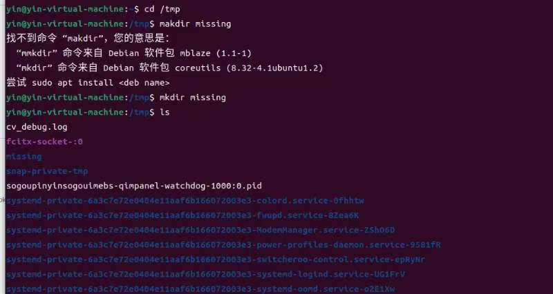
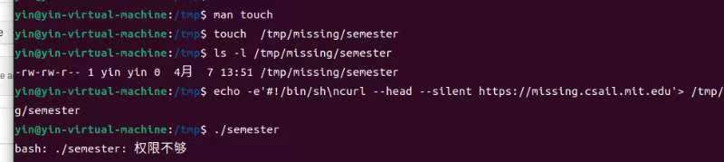
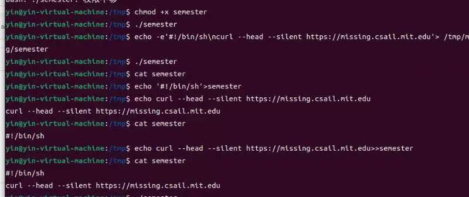
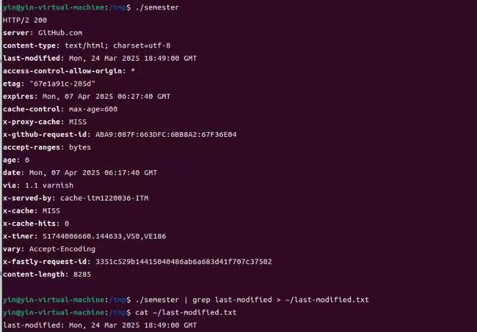
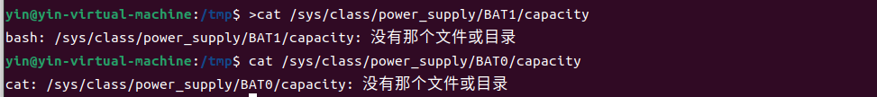

> ## 前提
>
> 1. 创建了虚拟机并完成了基本配置
> 2. 配置了中文输入法
> #### 遇到问题时的处理方法：大部分询问的AI，实在解决不了的就去询问了同学
>

## 做题过程及运行结果

### 1. 在/tmp下新建一个名为missing的文件夹

> 虽然中间出了点小插曲，但是最终完成了。

### 2. 用 man 查看程序 touch 的使用手册

>中间查看了多次使用手册，起初并不知道这有什么用，后来也了解了它的作用并知道了按“q”退出。

### 3. 用 touch 在 missing 文件夹中新建一个叫 semester 的文件。

### 4. 将以下内容一行一行地写入 semester 文件：
> #!/bin/sh
>
> curl --head --silent https://missing.csail.mit.edu 
### 5. 尝试执行这个文件。即，将该脚本的路径（./semester）输入到您的 shell 中并回车

>起初并无法运行，显示没有权限。

### 6. 查看 chmod 的手册(例如，使用 man chmod 命令)，并使用chmod命令来改变权限使./semester 能够成功执行

### 7. 使用 | 和 > ，将 semester 文件输出的最后更改日期信息，写入主目录下的 last-modified.txt 的文件中。

### 8. 写一段命令来从 /sys 中获取笔记本的电量信息，或者台式机 CPU 的温度。

> 由于VMware 虚拟机默认无法直接访问宿主机的电池信息（虚拟机通常模拟无电池的硬件），所以这项任务未能显示。