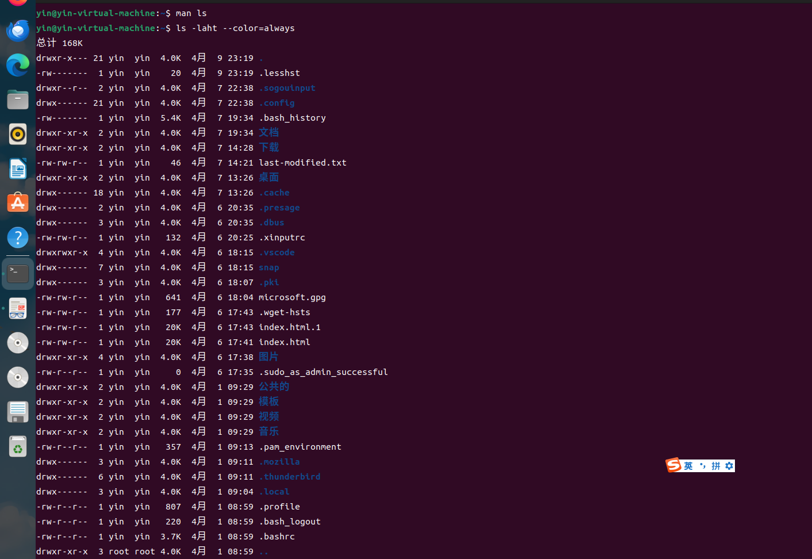
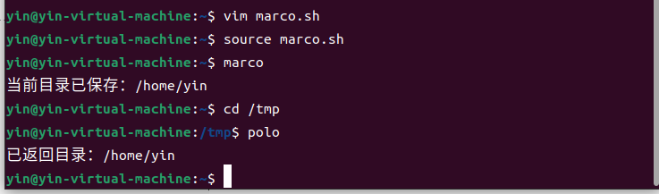
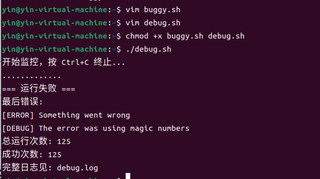
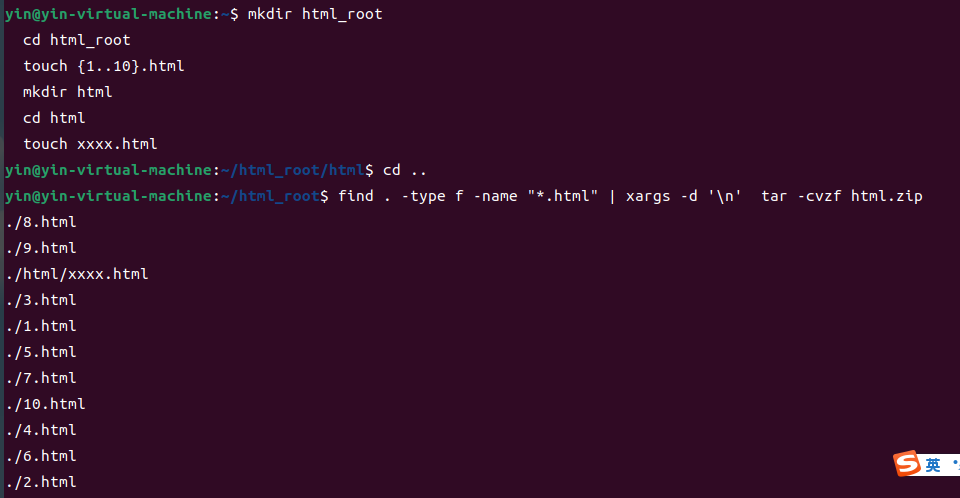
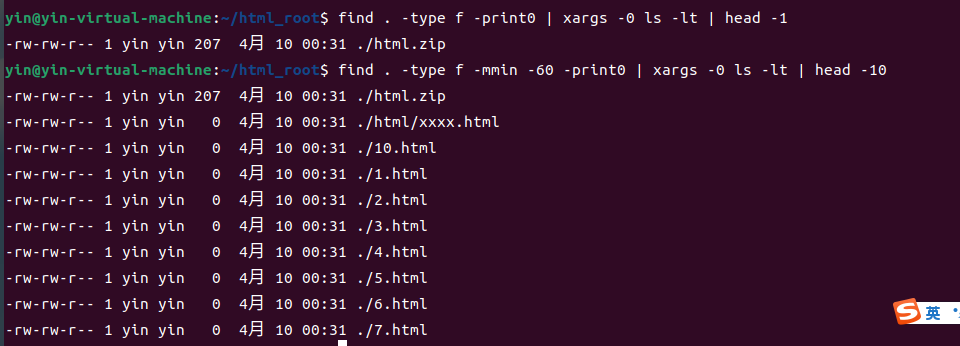

> ## 前提
>
>开始并没有vim编辑器，下载了vim后才可以进行创建脚本。
> 
> ## 做题过程及运行结果
>
> ### 1. 阅读 man ls ，然后使用 ls 命令进行如下操作：
>
> - 所有文件（包括隐藏文件）-a
> - 文件打印以人类可以理解的格式输出 (例如，使用 454M 而不是 454279954)-h
> - 文件以最近访问顺序排序：-t
> - 以彩色文本显示输出结果 --color=auto

> ### 2. 编写两个 bash 函数 marco 和 polo 执行下面的操作。 每当你执行 marco 时，当前的工作目录应当以某种形式保存，当执行 polo 时，无论现在处在什么目录下，都应当 cd 回到当时执行 marco 的目录。 为了方便 debug，你可以把代码写在单独的文件 marco.sh 中，并通过 source marco.sh 命令，（重新）加载函数。通过 source 来加载函数，随后可以在 bash 中直接使用。

> 在此步骤使下载了vim编辑器  
> 在脚本中输入Esc->:wq可以退出此脚本
> 
> ### 3. 假设您有一个命令，它很少出错。因此为了在出错时能够对其进行调试，需要花费大量的时间重现错误并捕获输出。 编写一段 bash 脚本，运行如下的脚本直到它出错，将它的标准输出和标准错误流记录到文件，并在最后输出所有内容。 加分项：报告脚本在失败前共运行了多少次。
>

>
> ### 4. 首先创建所需的文件,执行 find 命令:find . -type f -name "*.html" | xargs -d '\n'  tar -cvzf html.zip
>

>
>### 5. 编写一个命令或脚本递归的查找文件夹中最近使用的文件。更通用的做法，你可以按照最近的使用时间列出文件吗？ find . -type f -print0 | xargs -0 ls -lt | head -1
>

