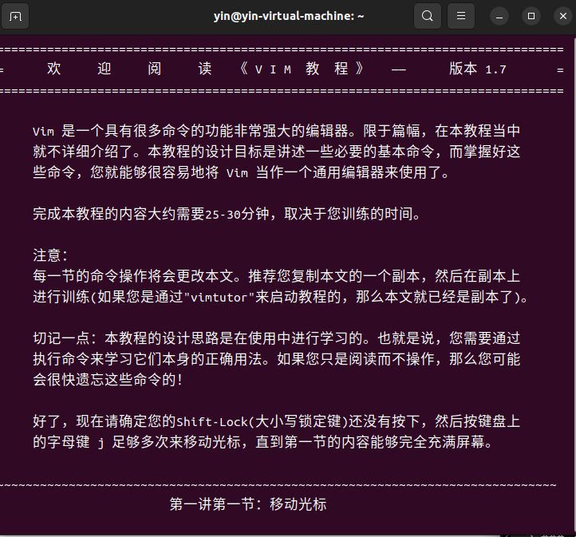

> ## 前提  
> 正确下载vim
>
>
## 做题过程及运行结果

### 1. 完成 vimtutor。

### 2. 下载我们的 vimrc，然后把它保存到 ~/.vimrc。 通读这个注释详细的文件 （用 Vim!）， 然后观察 Vim 在这个新的设置下看起来和使用起来有哪些细微的区别。

.png)
.png)

> 此时的输入文字相较于之前有了色彩的区别

### 3. 安装和配置一个插件： ctrlp.vim
1.  用 mkdir -p ~/.vim/pack/vendor/start 创建插件文件夹
2. 下载这个插件： cd ~/.vim/pack/vendor/start; git clone https://github.com/ctrlpvim/ctrlp.vim  并按照要求添加配置
3. 阅读插件文件，尝试用 CtrlP 来在一个工程文件夹里定位一个文件， 打开 Vim, 然后用 Vim 命令控制行开始 : CtrlP.
4. 自定义 CtrlP： 添加 configuration 到你的 ~/.vimrc 来用按 Ctrl-P 打开 CtrlP

    .png)
    .png)

###  4.练习使用 Vim, 在你自己的机器上重做演示。

.png)
.png)

> 在此之中遇到了插件不兼容的问题，删除并重新下载了好多次vim才得以解决

### 5. 下个月用 Vim 完成_所有_的文件编辑。每当不够高效的时候，或者你感觉 “一定有一个更好的方式”， 尝试求助搜索引擎，很有可能有一个更好的方式。如果你遇到难题， 来我们的答疑时间或者给我们发邮件。

### 6. 在你的其他工具中设置 Vim 快捷键 （见上面的操作指南）。

.png)
.png)

### 7. 进一步自定义你的 ~/.vimrc 和安装更多插件。 安装插件最简单的方法是使用 Vim 的包管理器，即使用 vim-plug 安装插件：
1. 安装 vim-plug
2. 修改 ~/.vimrc

.png)

3. 在 vim 命令行中执行 :PlugInstall
> 此步骤是我觉得最难的一步，因为怎么都无法执行 :PlugInstall，试了好多种方法解决了

.png)

### 8. 用 Vim 宏将 XML 转换到 JSON (例子文件)。 尝试着先完全自己做，但是在你卡住的时候可以查看上面 宏 章节。
> 一开始我1的例子是

.png)

> 经过在vim编辑界面的操作后变成了如下图所示

.png)