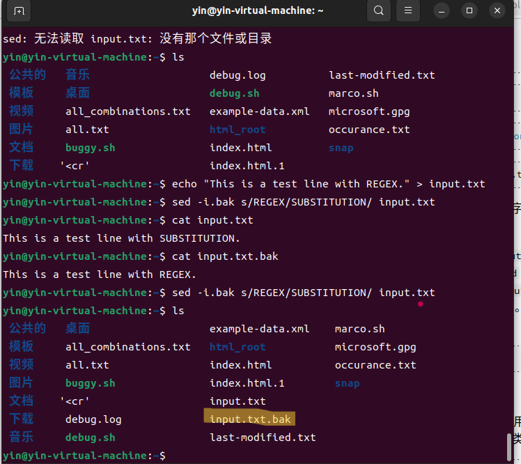
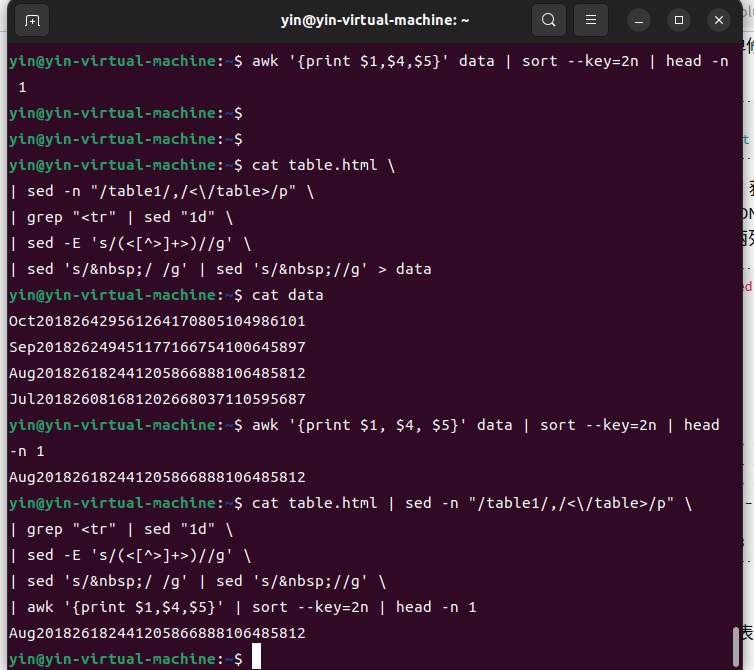

> ## 前提  
> 
> 第一题的正则表达式部分暂时还没有完成，先完成的后半部分  
> 本章有许多不会的问题，在虚拟机中还存在许多的网络问题花费了许多时间

### 1. 统计 words 文件 (/usr/share/dict/words) 中包含至少三个 a 且不以 's 结尾的单词个数。

1. .png)
2. 这些单词中，出现频率前三的末尾两个字母是什么？ sed 的 y 命令，或者 tr 程序也许可以帮你解决大小写的问题。

.png)

3. 共存在多少种词尾两字母组合？

.png)

4. 还有一个很 有挑战性的问题：哪个组合从未出现过？ 为了得到没出现的组合，首先我们要生成一个包含全部组合的列表，然后再使用上面得到的出现的组合，比较二者不同即可。

> 之前的：  

.png)

> 之后的：
  
.png)

### 3. 进行原地替换听上去很有诱惑力，例如： sed s/REGEX/SUBSTITUTION/ input.txt > input.txt。但是这并不是一个明智的做法，为什么呢？还是说只有 sed 是这样的? 查看 man sed 来完成这个问题。sed s/REGEX/SUBSTITUTION/ input.txt > input.txt 表达式中后一个 input.txt 会首先被清空，而且是发生在前的。所以前面一个 input.txt 在还没有被 sed 处理时已经为空了。在使用正则处理文件前最好是首先备份文件。

### 4. 找出您最近十次开机的开机时间平均数、中位数和最长时间。

1. .png)
.png)
2. 精简一下：

.png)

3. 可以看到启动时间精确的秒数

.png)

4. 获取最短时间、最长时间、平均数和中位数

.png)

5. 编写脚本 getlog.sh 来获取最近十次的启动时间数据：

.png)

### 5. 查看之前三次重启启动信息中不同的部分(参见 journalctl 的 -b 选项)。将这一任务分为几个步骤，首先获取之前三次启动的启动日志，也许获取启动日志的命令就有合适的选项可以帮助您提取前三次启动的日志，亦或者您可以使用 sed '0,/STRING/d' 来删除 STRING 匹配到的字符串前面的全部内容。然后，过滤掉每次都不相同的部分，例如时间戳。下一步，重复记录输入行并对其计数(可以使用 uniq )。最后，删除所有出现过 3 次的内容（因为这些内容上三次启动日志中的重复部分）。 简单修改上面使用的 getlog.sh，获取最近三次的日志。
> 脚本为：  

.png)

> 发送的命令为：  

.png)

> 运行对比的不同（虽然看着挺不对的样子）：  

.png)

### 6. 在网上找一个数据集，或者找一些使用 curl 获取数据集并提取其中两列数据，使用一条指令来找出其中一列的最大值和最小值，用另外一条指令计算两列之间差的总和。  

> 这一步中的寻找数据集部分费了我好长时间，最后还是自己手动下载的数据集内容才得以解决这个问题

