> ## 前提
>
>这一章很难，好多都没有写完
>

## 做题过程及运行结果

### 一、任务控制

#### 1. 我们可以使用类似 ps aux | grep 这样的命令来获取任务的 pid ，然后您可以基于 pid 来结束这些进程。但我们其实有更好的方法来做这件事。在终端中执行 sleep 10000 这个任务。然后用 Ctrl-Z 将其切换到后台并使用 bg 来继续允许它。现在，使用 pgrep 来查找 pid 并使用 pkill 结束进程而不需要手动输入 pid。

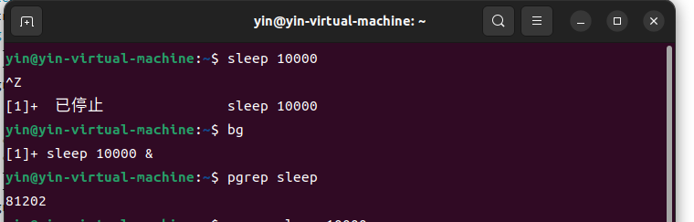

#### 2.(1) 如果您希望某个进程结束后再开始另外一个进程， 应该如何实现呢？ 在这个练习中，我们使用 sleep 60 & 作为先执行的程序。一种方法是使用 wait 命令。尝试启动这个休眠命令，然后待其结束后再执行 ls 命令。

.png)

#### 2.(2) 但是，如果我们在不同的 bash 会话中进行操作，则上述方法就不起作用了。因为 wait 只能对子进程起作用。之前我们没有提过的一个特性是，kill 命令成功退出时其状态码为 0 ，其他状态则是非 0。kill -0 则不会发送信号，但是会在进程不存在时返回一个不为 0 的状态码。请编写一个 bash 函数 pidwait ，它接受一个 pid 作为输入参数，然后一直等待直到该进程结束。您需要使用 sleep 来避免浪费 CPU 性能。

.png)

#### 2.(3) 需要注意的是，这里 while 判断的是命令行的返回值而不是布尔值，这个和其他语言有所区别。返回值 0 表示成功所以能够进入循环

.png)

### 二、终端多路复用

#### 1. 此为练习tmux的截图

> 这将创建一个新的 tmux 会话，底部有一个漂亮的全绿色状态栏：

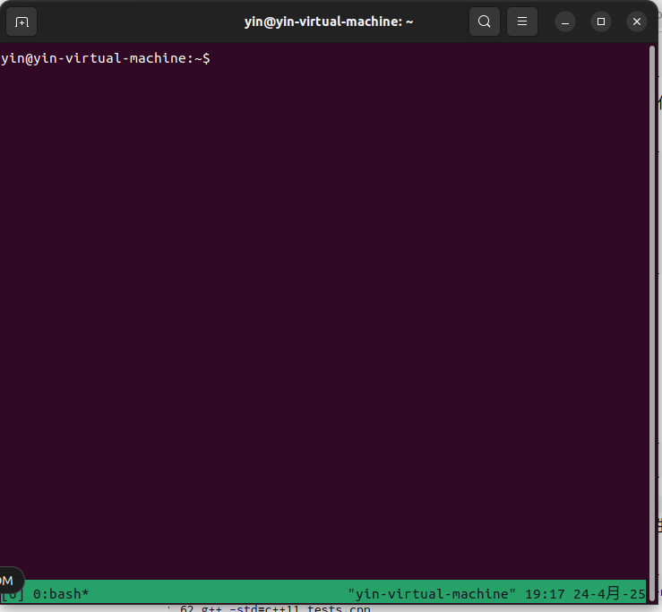

> 我们可以对窗格有所了解。当您创建新会话时，tmux 将默认从一个窗口和一个面板开始。我们想要一个漂亮的分屏.(用的ctrl+b %,ctrl+b 左右箭头可以改变分屏的左右输入光标,ctrl+b d表示关闭此文件,ctrl+b p表示切换到下一个窗口)

> 如果你创建了很多窗口，你可能会发现直接通过键入窗口的编号来进入窗口很有用（状态栏会告诉你哪个窗口有哪个编号），只需在状态栏中使用C-b <number> 窗口名称前面的数字 where is 即可

> tmux ls,这将为您提供所有正在运行的会话的列表,  e.j. 0: 2 windows (created Sat Aug 15 17:55:34 2015) [199x44] (detached)
0： 2 个窗口 （创建于 2015 年 8 月 15 日星期六 17：55：34） [199x44] （分离）

> 要连接到该会话，请再次启动 tmux，但这次告诉它要附加到哪个会话：tmux attach -t 0

> tmux new -s database,这将创建一个名为 “database” 的新会话。tmux rename-session -t 0 database,可以重命名现有会话

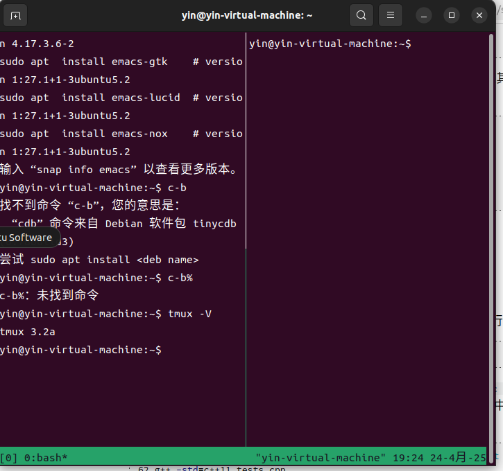

> 此截图为安装tumx、退出和使用的过程

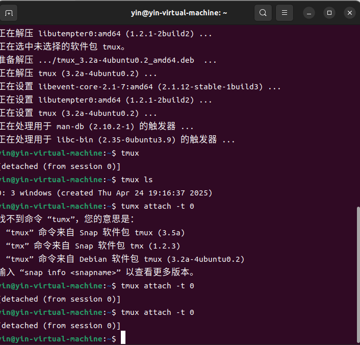

#### 2.别名

> 1. 创建一个 dc 别名，它的功能是当我们错误的将 cd 输入为 dc 时也能正确执行。
> 2. 执行 history | awk '{$1="";print substr($0,2)}' | sort | uniq -c | sort -n | tail -n 10 来获取您最常用的十条命令，尝试为它们创建别名。注意：这个命令只在 Bash 中生效，如果您使用 ZSH，使用 history 1 替换 history。

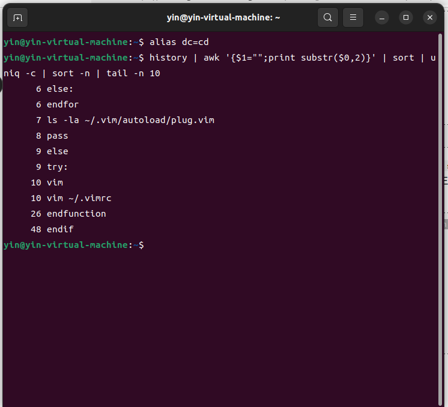

### 三、配置文件

> 1. 为您的配置文件新建一个文件夹，并设置好版本控制 在其中添加至少一个配置文件，比如说您的 shell，在其中包含一些自定义设置（可以从设置 $PS1 开始）。 建立一种在新设备进行快速安装配置的方法（无需手动操作）。最简单的方法是写一个 shell 脚本对每个文件使用 ln -s，也可以使用专用工具 在新的虚拟机上测试该安装脚本。 将您现有的所有配置文件移动到项目仓库里。 将项目发布到 GitHub

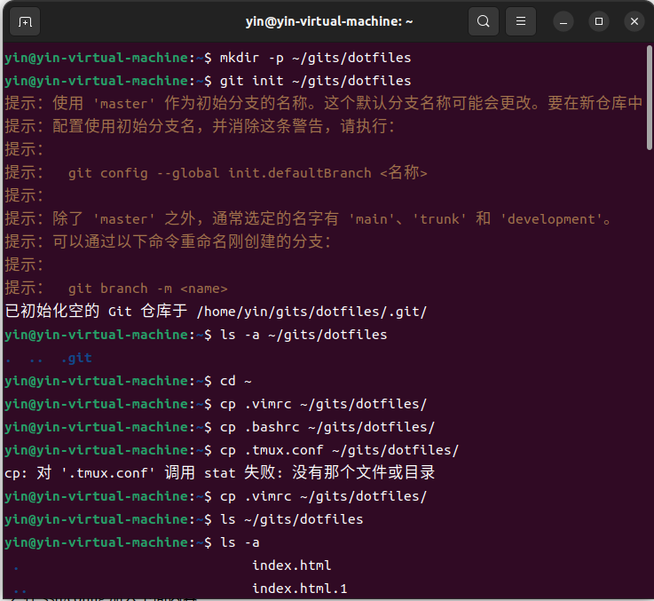

> 2. 此为配置git的过程

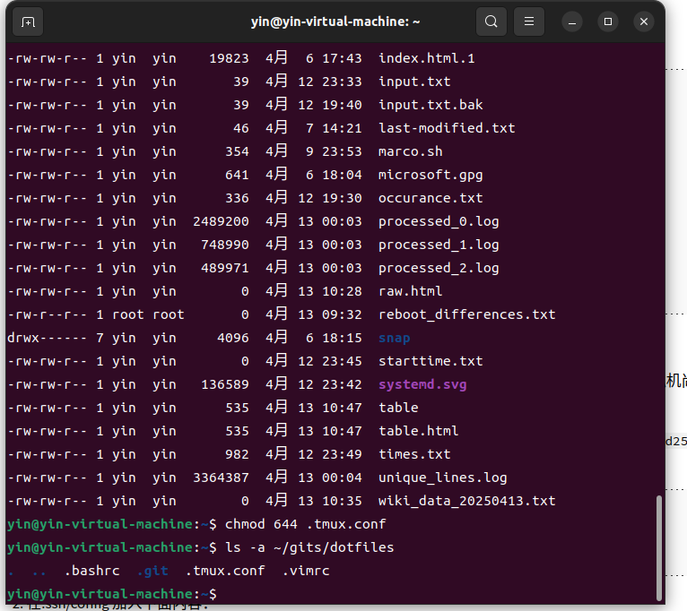

> 3. 此为克隆仓库的代码

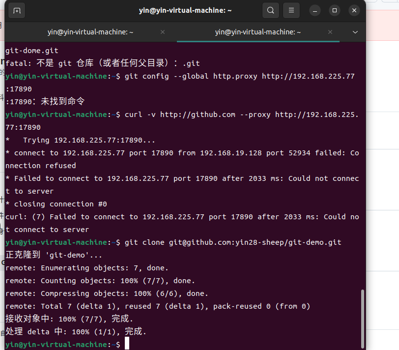

> 4. 我以为不知道运行脚本后为什么会这样

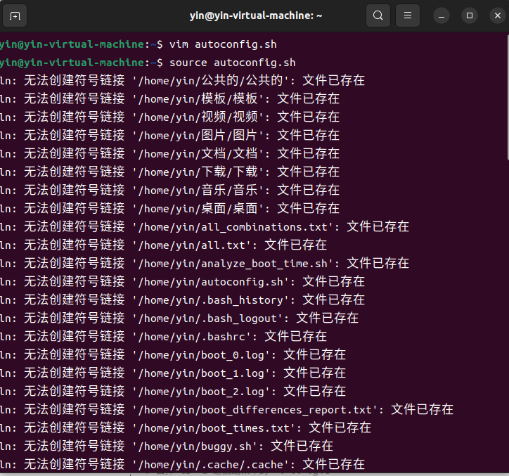

### 四、远端设备

> 1. 前往 ~/.ssh/ 并查看是否已经存在 SSH 密钥对。如果不存在，请使用 ssh-keygen -o -a 100 -t ed25519 来创建一个

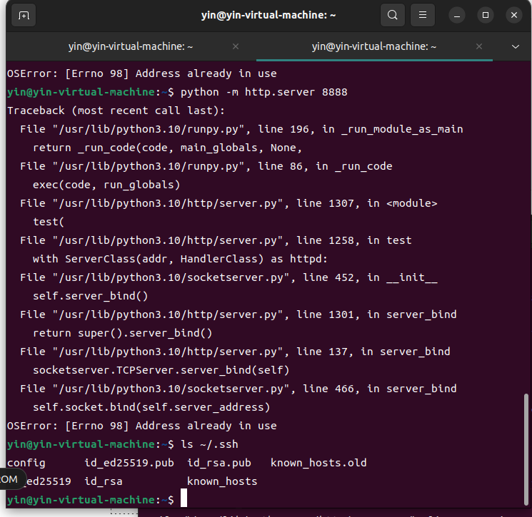

> 2. 在.ssh/config 加入下面内容：

> 3. 后面不知道怎么弄了

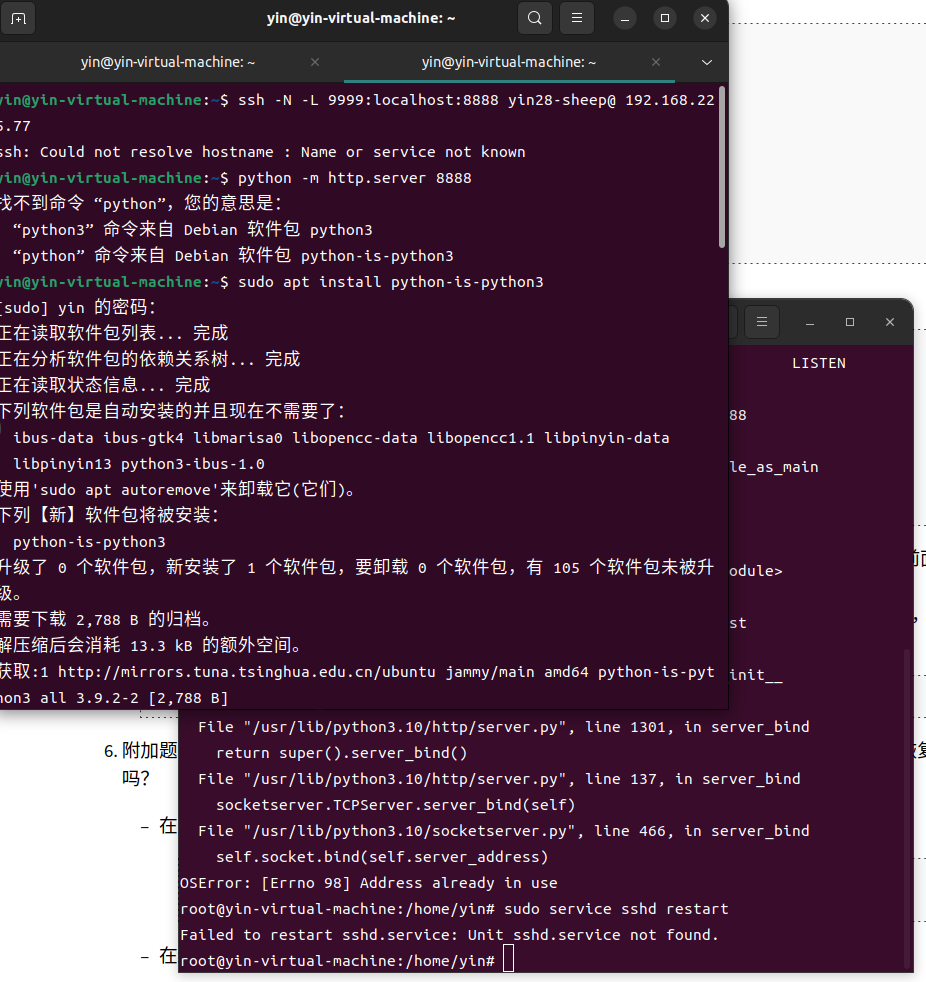