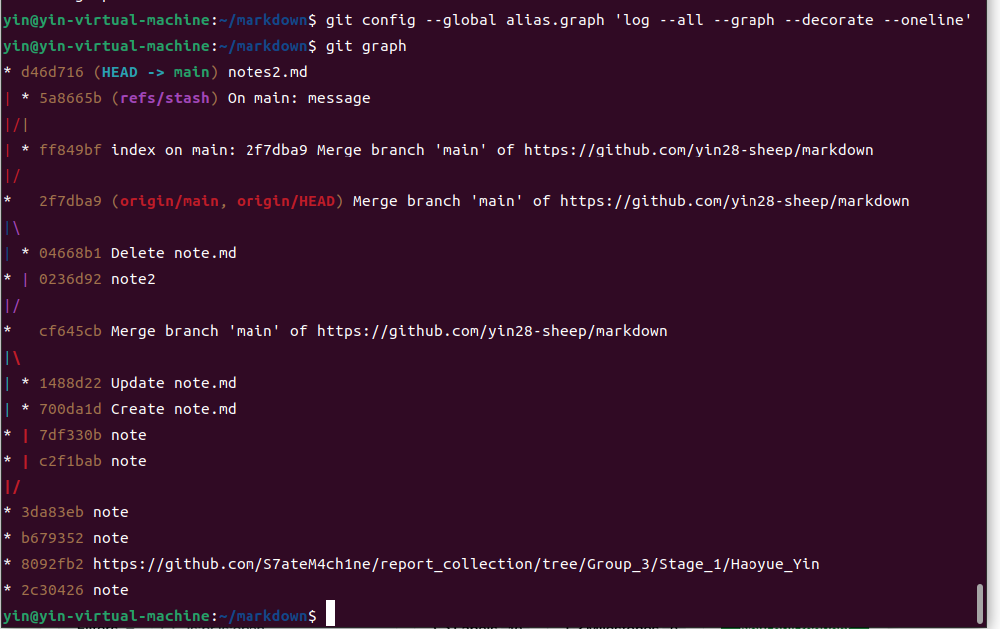

## 前提
>
> 在使用git clone时总是克隆失败，虽然这中间走了很多弯路，但是也学会了虚拟机怎么设置代理这种问题，于我而言是非常受益匪浅的

### 1. 由于我之前用过git，所以第一题我就直接跳过了

### 2. Fork 本课程网站的仓库
#### 1. 将版本历史可视化并进行探索

.(2).png)

#### 2. 是谁最后修改了 README.md 文件？（提示：使用 git log 命令并添加合适的参数）

.png)

#### 3. 最后一次修改_config.yml 文件中 collections: 行时的提交信息是什么？（提示：使用 git blame 和 git show）

.png)

### 3. 使用 Git 时的一个常见错误是提交本不应该由 Git 管理的大文件，或是将含有敏感信息的文件提交给 Git 。尝试向仓库中添加一个文件并添加提交信息，然后将其从历史中删除 ( 这篇文章也许会有帮助)；

#### 1. 首先提交一些敏感信息

.png)

#### 2. 使用 git filter-branch 清除提交记录

.png)

### 4. 从 GitHub 上克隆某个仓库，修改一些文件。当您使用 git stash 会发生什么？当您执行 git log –all –oneline 时会显示什么？通过 git stash pop 命令来撤销 git stash 操作，什么时候会用到这一技巧？

.png)

### 5. 与其他的命令行工具一样，Git 也提供了一个名为 ~/.gitconfig 配置文件 (或 dotfile)。请在 ~/.gitconfig 中创建一个别名，使您在运行 git graph 时，您可以得到 git log –all –graph –decorate –oneline 的输出结果.

### 6. 通过执行 git config –global core.excludesfile ~/.gitignore_global 在 ~/.gitignore_global 中创建全局忽略规则

#### 1. 配置全局 gitignore 文件来自动忽略系统或编辑器的临时文件

.png)

#### 2. 例如 .DS_Store

.png)

### 7. 克隆 本课程网站的仓库，找找有没有错别字或其他可以改进的地方，在 GitHub 上发起拉取请求（Pull Request）

#### 1. 首先 fork 本网站仓库，然后克隆 fork 后的仓库

.png)

#### 2. 在本地进行修改后，提交到 fork 后的仓库

.png)

> 如您所见，这一步非常不成功，虽然我也不知道为什么，孩子已经尽力了:-(