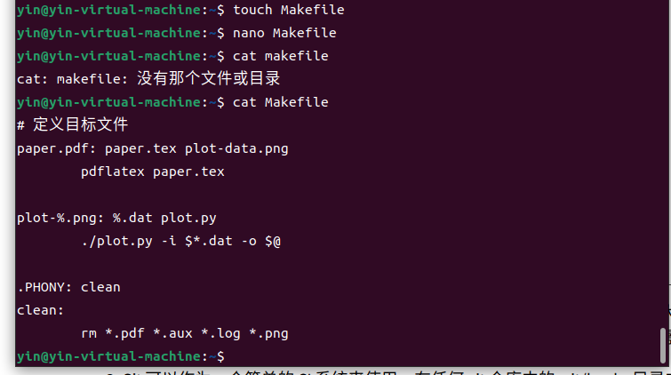
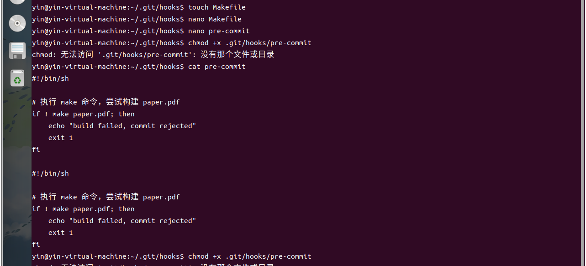

## 做题过程及运行结果

### 1. 大多数的 makefiles 都提供了 一个名为 clean 的构建目标，这并不是说我们会生成一个名为 clean 的文件，而是我们可以使用它清理文件，让 make 重新构建。您可以理解为它的作用是“撤销”所有构建步骤。在上面的 makefile 中为 paper.pdf 实现一个 clean 目标。您需要构建 phony。您也许会发现 git ls-files 子命令很有用。其他一些有用的 make 构建目标可以在这里找到；编写 Makefile,可以列出没有被 git 追踪的文件，一般是构建的中间产物，当然，需要首先设置 git 的忽略规则。

### 2. Rust 的构建系统 的依赖管理我学不明白

### 3. Git 可以作为一个简单的 CI 系统来使用，在任何 git 仓库中的 .git/hooks 目录中，您可以找到一些文件（当前处于未激活状态），它们的作用和脚本一样，当某些事件发生时便可以自动执行。请编写一个 pre-commit 钩子，当执行 make 命令失败后，它会执行 make paper.pdf 并拒绝您的提交。这样做可以避免产生包含不可构建版本的提交信息；修改 .git/hooks 目录下面的 pre-commit.sample 文件并将其命名为 pre-commit

### 4. 这一题我搞不出来